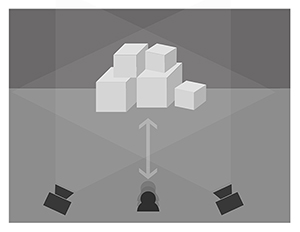

##OpenFrameworks Final - Projection mapping

###Description of project

I am designing an interactive installation by simulating the environment of nature and city, using sounds and videos, to boost audience to rethink the boundaries and relationships between nature, city, and human. Also, in order to remind people of the beauty of nature.

People who live in big city and are around by technological products. They barely have time and chances to experience the beauty of nature.

I connect distance sensor with openFrameworks. The openFrameworks will get the serial which send by distance senor to control the different videos. I use the   addon of ofxsphon to connect openFrameworks with MadMapper, then the Madmapper will grap the running window from openFrameworks and project it into physical objects.
###Schematic diagram

